# Jarkom-Modul-3-D05-2021

- Andika Nugrahanto (0511194000031)
- Muhammad Rayhan Raffi Pratama (05111940000110)
- Fadhil Dimas Sucahyo (05111940000212)

## Pendahuluan

### Setting Topologi

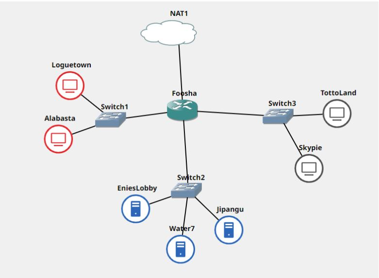

### Edit Knofigurasi Network

#### Foosha

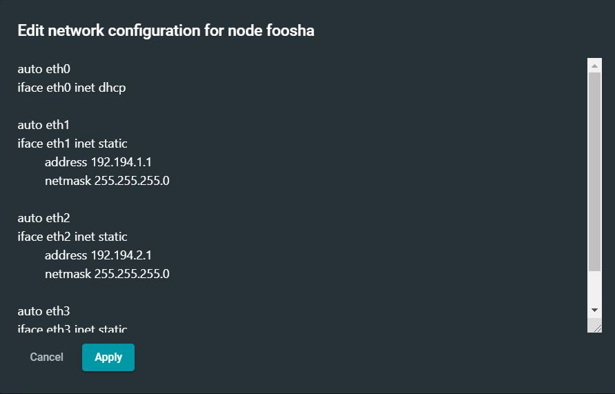
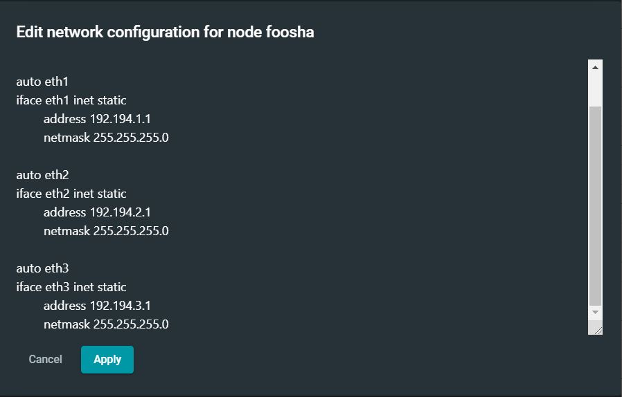

#### EniesLobby

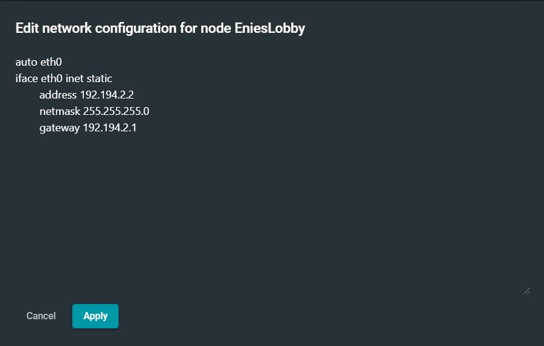

#### Water7

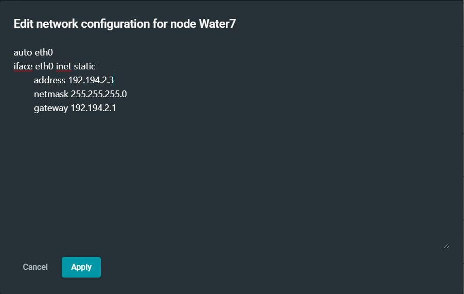

#### Jipangu

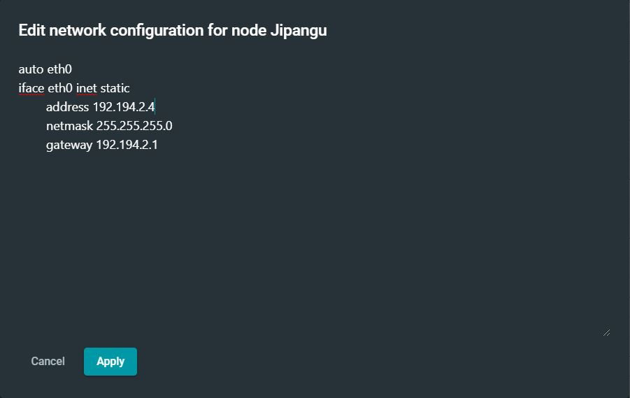

#### Loguetown, Alabasta, Totoland, Skypie

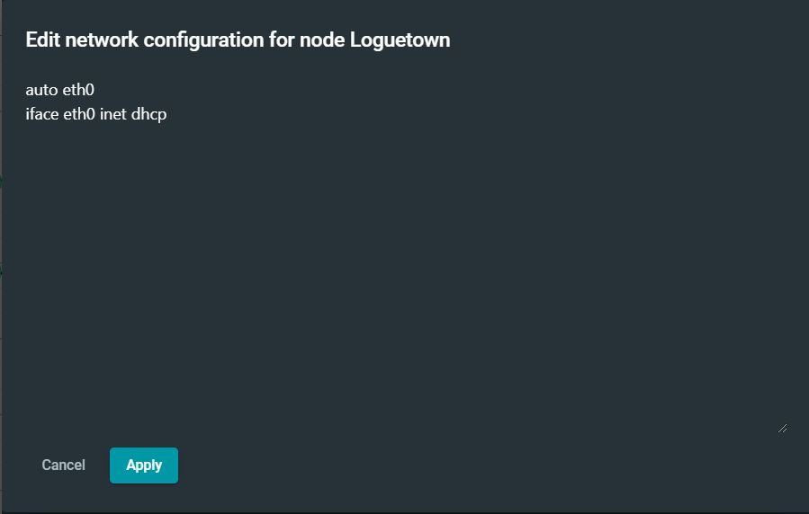

## no. 1

Luffy bersama Zoro berencana membuat peta tersebut dengan kriteria EniesLobby sebagai DNS Server, Jipangu sebagai DHCP Server, Water7 sebagai Proxy Server

### Jawab

#### Foosha

Menjalankan command `iptables -t nat -A POSTROUTING -o eth0 -j MASQUERADE -s 192.194.0.0/16` yang digunakan supaya dapat terhubung ke jaringan luar pada router `Foosha`
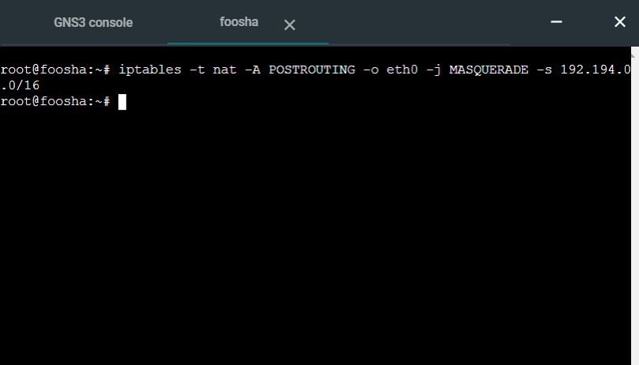

Setelah itu pada EniesLobby, Water7, Jipangu dijalankan command `echo "nameserver 192.168.122.1" > /etc/resolv.conf` untuk setting IP DNS agar dapat terhubung ke jaringan luar.

#### EniesLobby

pada EniesLobby jalankan command `apt-get update` dan `apt-get install bind9 -y` untuk menginstall bind9
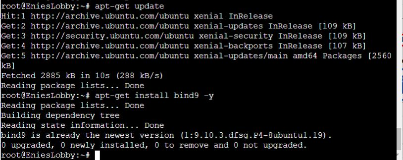

#### Jipangu

pada Jipangu jalankan command `apt-get update` dan `apt-get install isc-dhcp-server -y` untuk menginstall isc-dhcp-server
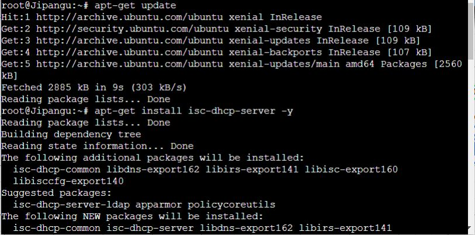

Kemudian setting `INTERFACES` yang digunakan oleh Jipangu pada file `/etc/default/isc-dhcp-server` dengan menambahkan `eth0`
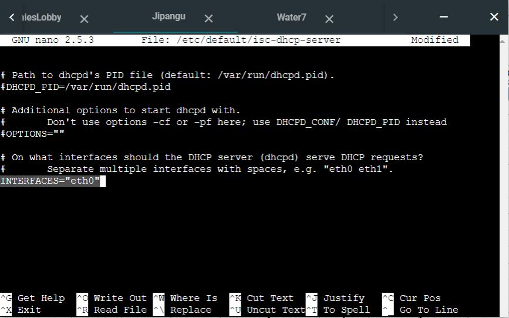

#### Water7

pada Water7 jalankan command `apt-get update` dan `apt-get install squid -y` untuk menginstall squid
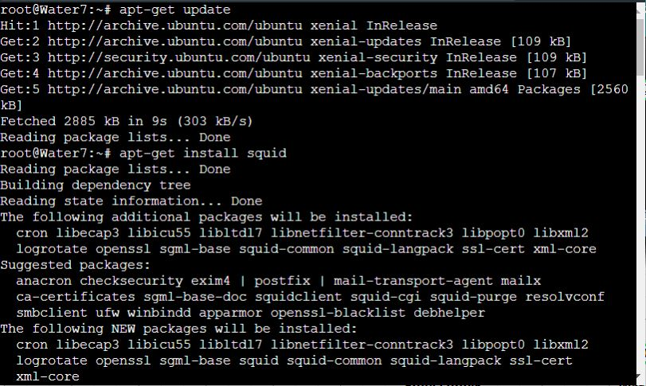

## no. 2

Foosha sebagai DHCP Relay

### Jawab

#### Foosha

pada Foosha jalankan command `apt-get update` dan `apt-get install isc-dhcp-relay -y` untuk menginstall isc-dhcp-relay
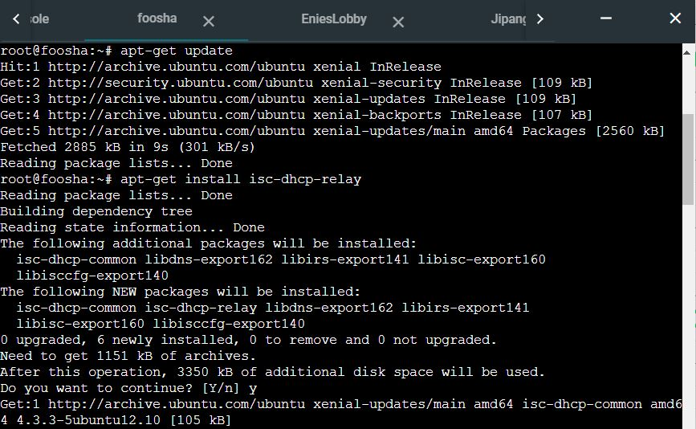

Kemudian edit file `/etc/default/isc-dhcp-relay` dengan menambahkan `SERVER = "IP Jipangu"` dan `INTERFACES = "eth1 eth2 eth3"`
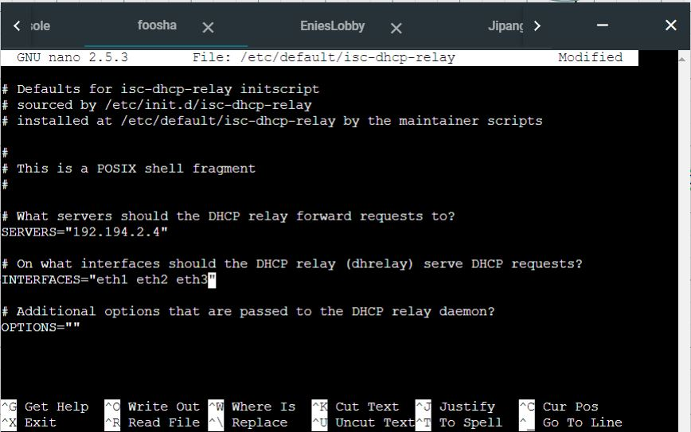

Lalu jalankan command `service isc-dhcp-relay restart`

## no. 3

Client yang melalui Switch1 mendapatkan range IP dari [prefix IP].1.20 - [prefix IP].1.99 dan [prefix IP].1.150 - [prefix IP].1.169

### Jawab

#### Jipangu

Edit file `/etc/dhcp/dhcpd.conf` dengan menambahkan:

```bash
    subnet 192.194.1.0 netmask 255.255.255.0 {
        range 192.194.1.20 192.194.1.99;
        range 192.194.1.150 192.194.1.169;
        option routers 192.194.1.1;
        option broadcast-address 192.194.1.255;
        option domain-name-servers 192.194.2.2;
        default-lease-time 360;
        max-lease-time 7200;
    }
```

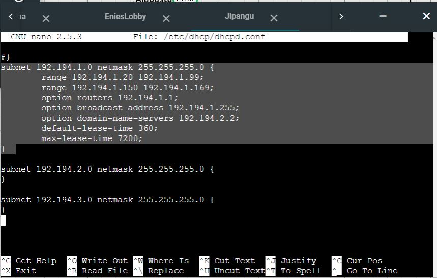

Lalu jalankan command `service isc-dhcp-server restart`

## no. 4

Client yang melalui Switch3 mendapatkan range IP dari [prefix IP].3.30 - [prefix IP].3.50

### Jawab

#### Jipangu

Edit file `/etc/dhcp/dhcpd.conf` dengan menambahkan:

```bash
    subnet 192.194.3.0 netmask 255.255.255.0 {
        range 192.194.3.30 192.194.3.50;
        option routers 192.194.3.1;
        option broadcast-address 192.194.3.255;
        option domain-name-servers 192.194.2.2;
        default-lease-time 720;
        max-lease-time 7200;
    }
```

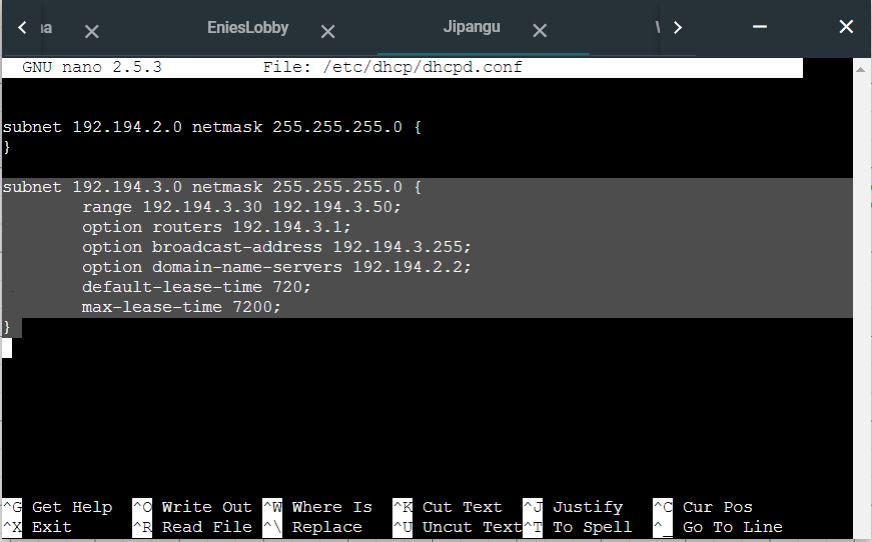

Lalu jalankan command `service isc-dhcp-server restart`

## no. 5

Client mendapatkan DNS dari EniesLobby dan client dapat terhubung dengan internet melalui DNS tersebut.

### Jawab

#### EniesLobby

Edit file `/etc/bind/named.conf.options` dengan menambahkan

```bash
    forwarders {
        "IP nameserver dari Foosha";
    };

    allow-query{any;};
```

dan mengkomen bagian

```bash
    // dnssec-validation auto;
```

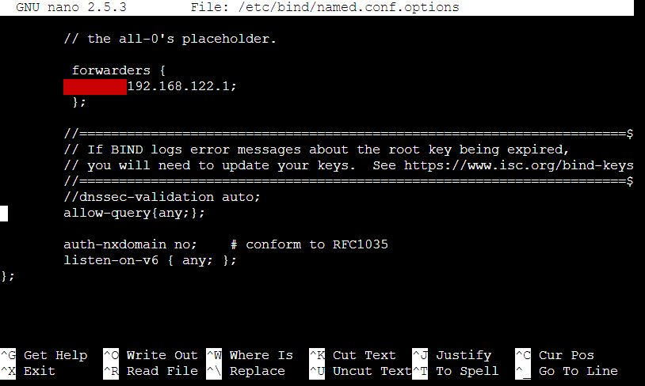

kemudian jalankan command `service bind9 restart`

#### Jipangu

Edit file `/etc/dhcp/dhcpd.conf` dengan menambahkan baris `option domain-name-servers "IP EniesLobby"` pada `subnet 192.194.1.0` dan `subnet 192.194.3.0`

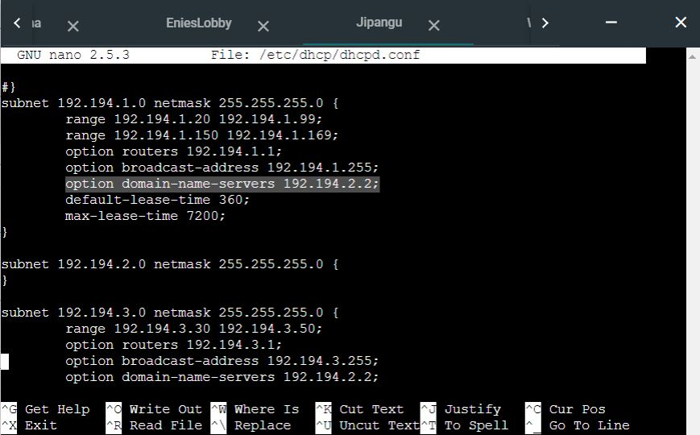

## no. 6

Lama waktu DHCP server meminjamkan alamat IP kepada Client yang melalui Switch1 selama 6 menit sedangkan pada client yang melalui Switch3 selama 12 menit. Dengan waktu maksimal yang dialokasikan untuk peminjaman alamat IP selama 120 menit.

### Jawab

#### Jipangu

Edit file `/etc/dhcp/dhcpd.conf` dengan menambahkan baris ini pada `subnet 192.194.1.0`

```bash
        default-lease-time 360;
        max-lease-time 7200;
```

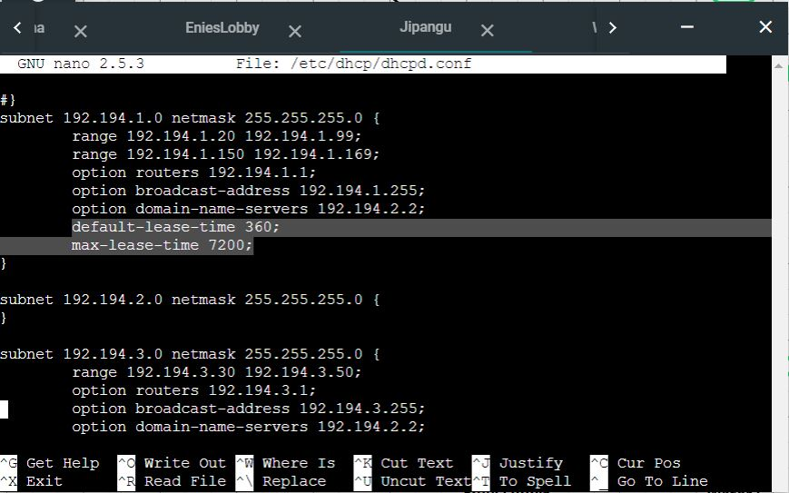

dan menambahkan baris ini pada `subnet 192.194.3.0`

```bash
        default-lease-time 720;
        max-lease-time 7200;
```

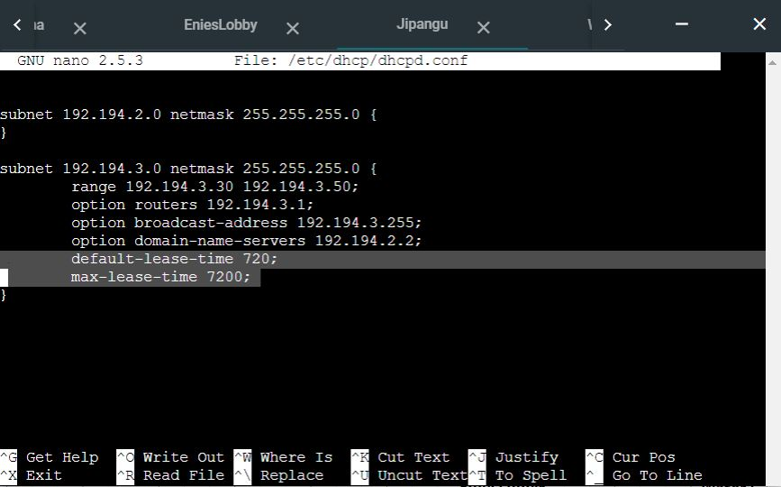

## no. 7

Luffy dan Zoro berencana menjadikan Skypie sebagai server untuk jual beli kapal yang dimilikinya dengan alamat IP yang tetap dengan IP [prefix IP].3.69

### Jawab

#### Jipangu

Edit file `/etc/dhcp/dhcpd.conf` dengan menambahkan baris ini

```bash
    host Skypie {
        hardware ethernet "hardware address Skypie";
        fixed-address 192.194.3.69;
    }
```

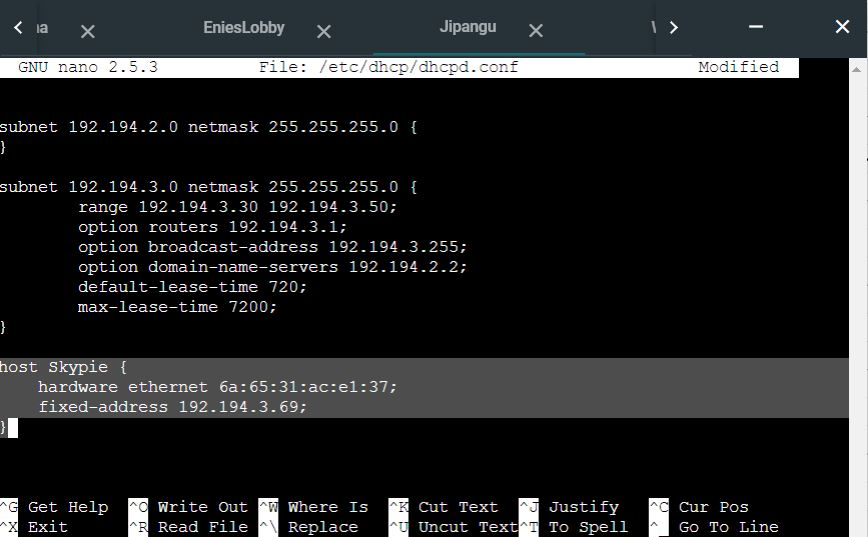

Lalu jalankan command `service isc-dhcp-server restart`

#### Skypie

Kemudian tambahkan `hwaddress ether "hardware address Skypie"` pada `/etc/network/interfaces` agar hwaddress tidak berubah-ubah ketika project direstart atau diexport

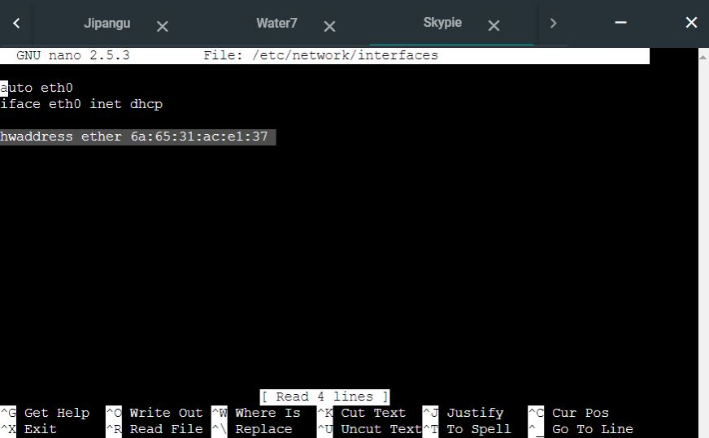

## no. 8

Loguetown digunakan sebagai client Proxy agar transaksi jual beli dapat terjamin keamanannya, juga untuk mencegah kebocoran data transaksi.
Pada Loguetown, proxy harus bisa diakses dengan nama jualbelikapal.yyy.com dengan port yang digunakan adalah 5000

### Jawab

#### Water7

Edit file `/etc/squid/squid.conf` dengan menambahkan

```bash
    http_port 5000
    visible_hostname jualbelikapal.d05.com
    http_access allow all
```

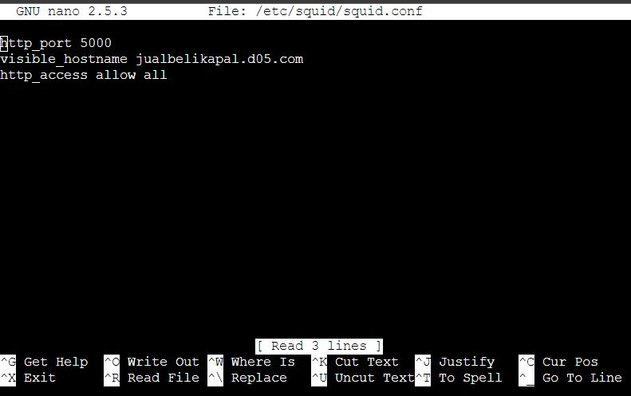

kemudian jalankan command `service squid restart`

#### EniesLobby

Edit file `nano /etc/bind/named.conf.local` dengan menambahkan

```bash
    zone "jualbelikapal.d05.com" {
        type master;
        file "/etc/bind/sunnygo/jualbelikapal.d05.com";
    };
```

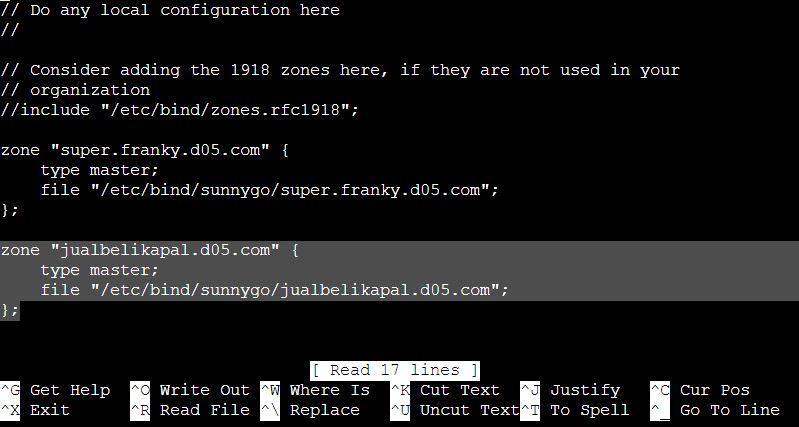

Kemudian buat folder sunnygo menggunakan command `mkdir /etc/bind/sunnygo`. Setelah itu jalankan command `cp /etc/bind/db.local /etc/bind/sunnygo/jualbelikapal.d05.com`. Setelah itu edit file `nano /etc/bind/sunnygo/jualbelikapal.d05.com` dengan mengisi

```bash
    $TTL    604800
    @       IN      SOA     jualbelikapal.d05.com. root.jualbelikapal.d05.com. (
                                2         ; Serial
                            604800         ; Refresh
                            86400         ; Retry
                            2419200         ; Expire
                            604800 )       ; Negative Cache TTL
    ;
    @       IN      NS      jualbelikapal.d05.com.
    @       IN      A       192.194.2.3 ; IP Water7
    www     IN      CNAME   jualbelikapal.d05.com.
```

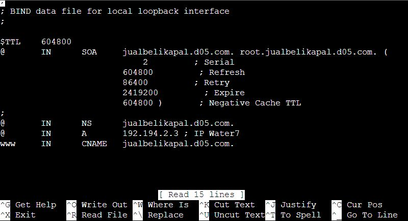

kemudian jalankan command `service bind9 restart`

#### Loguetown

Jalankan `apt-get update` dan `apt-get install lynx`

Aktifkan proxy dengan menjalankan command `export http_proxy="http://jualbelikapal.d05.com:5000"`. Kemudian jalankan command `env | grep -i proxy` untuk mengecek apakah proxy sudah tersetting.

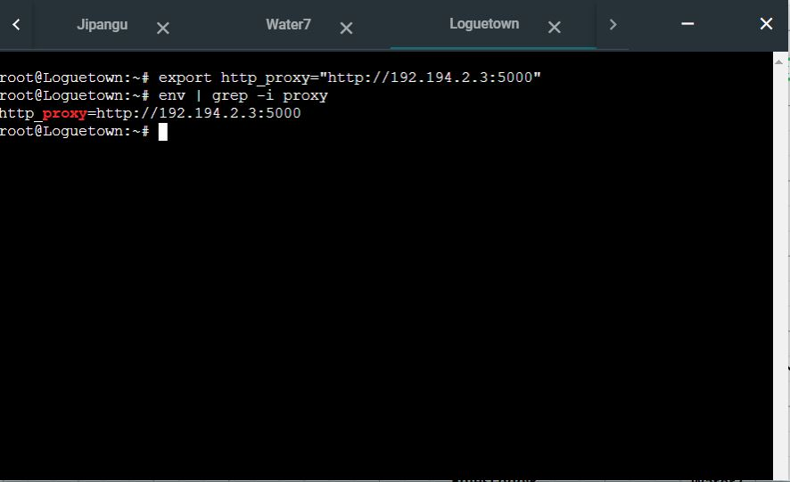

## no. 9

Agar transaksi jual beli lebih aman dan pengguna website ada dua orang, proxy dipasang autentikasi user proxy dengan enkripsi MD5 dengan dua username, yaitu luffybelikapalyyy dengan password luffy_yyy dan zorobelikapalyyy dengan password zoro_yyy

### Jawab

#### Water7

Jalankan `apt-get update` dan `apt-get install apache2-utils`

Kemudian jalankan command `htpasswd -cm /etc/squid/passwd luffybelikapald05`, option `c` digunakan untuk membuat file baru, sedangkan `m` digunakan supaya enkripsinya menggunakan MD5. Setelah itu masukkan password `luffy_d05`.

Kemudian jalankan command `htpasswd -m /etc/squid/passwd zorobelikapald05`. Setelah itu masukkan password `zoro_d05`.
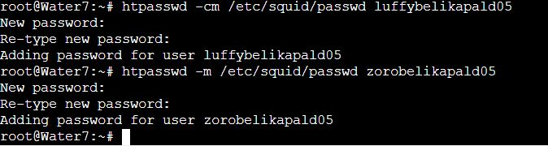

Setelah itu edit file `/etc/squid/squid.conf` menjadi

```bash
    http_port 5000
    visible_hostname jualbelikapal.d05.com
    auth_param basic program /usr/lib/squid/basic_ncsa_auth /etc/squid/passwd
    auth_param basic children 5
    auth_param basic realm Login
    auth_param basic credentialsttl 2 hours
    auth_param basic casesensitive on
    acl USERS proxy_auth REQUIRED
    http_access allow USERS
```

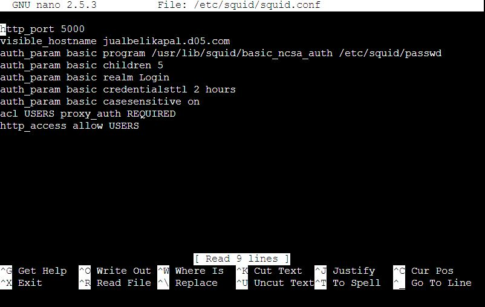

kemudian jalankan command `service squid restart`
